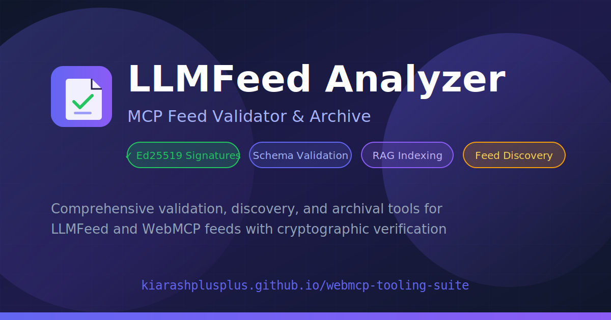

# WebMCP Tooling Suite

<div align="center">



### 🔐 The Complete Toolkit for Secure AI Agent Integration

**Validate • Sign • Discover • Archive**

[](https://kiarashplusplus.github.io/webmcp-tooling-suite/)
[](LICENSE)

---

</div>

## 📦 Packages

<table>
<tr>
<td width="50%">

### 🔍 Validator
**[@25xcodes/llmfeed-validator](https://npmjs.com/package/@25xcodes/llmfeed-validator)**

[](https://npmjs.com/package/@25xcodes/llmfeed-validator)
[](https://npmjs.com/package/@25xcodes/llmfeed-validator)

Validate LLMFeed structure + **Ed25519 signature verification**

```bash
npx @25xcodes/llmfeed-validator example.com
```

</td>
<td width="50%">

### ✍️ Signer
**[@25xcodes/llmfeed-signer](https://npmjs.com/package/@25xcodes/llmfeed-signer)**

[](https://npmjs.com/package/@25xcodes/llmfeed-signer)
[](https://npmjs.com/package/@25xcodes/llmfeed-signer)

Generate Ed25519 keys + sign LLMFeed JSON files

```bash
npx @25xcodes/llmfeed-signer keygen
npx @25xcodes/llmfeed-signer sign feed.json
```

</td>
</tr>
<tr>
<td width="50%">

### 📄 LLMS.txt Parser
**[@25xcodes/llmstxt-parser](https://npmjs.com/package/@25xcodes/llmstxt-parser)**

[](https://npmjs.com/package/@25xcodes/llmstxt-parser)
[](https://npmjs.com/package/@25xcodes/llmstxt-parser)

Parse & validate [llms.txt](https://llmstxt.org) files with RAG utilities

```bash
import { parseLLMSTxt, validateLLMSTxt } from '@25xcodes/llmstxt-parser'
```

</td>
<td width="50%">

### 🏥 Health Monitor
**[@25xcodes/llmfeed-health-monitor](https://npmjs.com/package/@25xcodes/llmfeed-health-monitor)**

[](https://npmjs.com/package/@25xcodes/llmfeed-health-monitor)
[](https://npmjs.com/package/@25xcodes/llmfeed-health-monitor)

Feed health monitoring, crawling & outreach automation

```bash
npx @25xcodes/llmfeed-health-monitor check example.com
```

</td>
</tr>
<tr>
<td colspan="2">

### 🤖 GitHub Action
**[kiarashplusplus/webmcp-tooling-suite/packages/github-action](packages/github-action)**

[](https://github.com/kiarashplusplus/FIML)

Automated CI/CD validation with badge generation

```yaml
- uses: kiarashplusplus/webmcp-tooling-suite/packages/github-action@v1
  with:
    feed: '.well-known/mcp.llmfeed.json'
    create-badge: 'true'
```

</td>
</tr>
</table>

---

## 🌐 The Suite

A comprehensive web application for the **Web Model Context Protocol (WebMCP)** and **LLMFeed** ecosystem.

**[→ Launch the Suite](https://kiarashplusplus.github.io/webmcp-tooling-suite/)**

---

## Project Summary

The WebMCP Tooling Suite addresses critical gaps identified in the MCP/WebMCP/LLMFeed ecosystem:

| Gap | Problem | Our Solution |
|-----|---------|--------------|
| **Trust Validation** | No automated validator for LLMFeed cryptographic signatures | Full Ed25519 signature verification with public key fetching |
| **Context Indexing** | Prompt bloat from large tool catalogs degrades LLM performance | RAG-optimized indexing with 50%+ token savings |
| **Feed Discovery** | Fragmented, manual feed discovery across the web | Universal feed directory with .well-known URI support |

## Features

### Implemented

- **Universal LLMFeed Validator** — Comprehensive validation from URL, file upload, or paste
  - Structural validation (feed_type, metadata, capabilities)
  - JSON Schema conformance checking
  - **Full Ed25519 cryptographic signature verification**
  - Security scoring (0-100) with actionable remediation guidance
  - Signature debugger for troubleshooting failed verifications

- **Feed Discovery & Analysis** — Discover feeds from any URL or domain
  - Auto-detection of `.well-known/mcp.llmfeed.json` paths
  - Capability extraction with JSON-RPC invocation examples
  - Token estimation for context planning

- **Feed Directory** — Centralized, public directory of LLMFeeds
  - "Top Feeds" (by capabilities) and "Latest Published" sections
  - Scraper-friendly JSON links with data attributes
  - GitHub authentication for publishing (prevents spam)
  - **Curated feeds** from verified WebMCP sites

- **Submit Your Feed** — Self-service feed submission workflow
  - 3-step process: Validate → Sign In → Submit
  - Automatic feed validation with score
  - **Embeddable verification badges** (verified, signed, score)
  - HTML, Markdown, and SVG badge formats

- **Universal Archive** — Versioned feed archival with persistence
  - Timestamped snapshots for any feed URL
  - Version history browsing and comparison
  - Export/restore capabilities
  - Immutable versions for cryptographic trust

- **RAG Indexing Preparation** — Transform feeds for vector databases
  - Structured output optimized for embedding models
  - Token efficiency metrics and savings calculation
  - Export to Pinecone, Weaviate, Chroma-compatible format

## Architecture

```
┌─────────────────────────────────────────────────────────────────┐
│                    WebMCP Tooling Suite                         │
├─────────────────────────────────────────────────────────────────┤
│  ┌──────────┐  ┌──────────┐  ┌──────────┐  ┌──────────┐        │
│  │Directory │  │Validator │  │Discovery │  │ Archive  │        │
│  │          │  │          │  │          │  │          │        │
│  │ • Browse │  │ • Parse  │  │ • Fetch  │  │ • Store  │        │
│  │ • Search │  │ • Verify │  │ • Analyze│  │ • Version│        │
│  │ • Curated│  │ • Score  │  │ • Inspect│  │ • Export │        │
│  └──────────┘  └──────────┘  └──────────┘  └──────────┘        │
│       ↑                                                         │
│  ┌──────────┐                                                   │
│  │ Submit   │ ← Self-service feed submission + badge generator  │
│  │ • Submit │                                                   │
│  │ • Badges │                                                   │
│  └──────────┘                                                   │
│                        ↓                                        │
│  ┌──────────────────────────────────────────────────────────┐  │
│  │              Core Library (llmfeed.ts)                    │  │
│  │  • Ed25519 verification  • Schema validation              │  │
│  │  • RAG preparation       • Token estimation               │  │
│  └──────────────────────────────────────────────────────────┘  │
│                        ↓                                        │
│  ┌──────────────────────────────────────────────────────────┐  │
│  │                   RAG Prep Tool                           │  │
│  │  → Vector-ready embeddings for semantic search            │  │
│  └──────────────────────────────────────────────────────────┘  │
└─────────────────────────────────────────────────────────────────┘
```

## Security Model

The validator implements the full Ed25519 trust verification chain:

```
Feed → Trust Block → Public Key Hint → Signature Verification
         ↓               ↓                    ↓
    signed_blocks    Fetch PEM key      Verify against
    enumeration      from URL           canonical payload
```

**Signature verification protects against:**
- Tool Poisoning — Malicious tool definition modifications
- Tool Shadowing — Fake tools intercepting legitimate calls
- Supply Chain Attacks — Compromised feed distributions

## Tech Stack

- **Framework**: React 18 + TypeScript + Vite
- **UI**: Radix UI primitives + Tailwind CSS v4 + shadcn/ui
- **Storage**: localStorage (default) + GitHub Gist sync (optional)
- **Auth**: GitHub OAuth (optional, via Cloudflare Worker)
- **Crypto**: Web Crypto API (native Ed25519)
- **State**: @tanstack/react-query + localStorage

## Deployment

This is a fully static site that can be deployed to:

- **GitHub Pages** - Zero configuration needed
- **Cloudflare Pages** - Connect repo and deploy
- **Netlify** - Automatic deploys from GitHub

### Optional: GitHub OAuth

For authenticated publishing to the directory, deploy a Cloudflare Worker:

```bash
# In a separate worker project
npx wrangler init webmcp-auth
```

Set these environment variables:
- `VITE_GITHUB_OAUTH_URL` - OAuth initiation endpoint
- `VITE_GITHUB_TOKEN_URL` - Token exchange endpoint

## Installation

```bash
# Clone the repository
git clone https://github.com/kiarashplusplus/webmcp-tooling-suite.git
cd webmcp-tooling-suite

# Install dependencies
npm install

# Start development server
npm run dev

# Build all packages
npm run build:packages
```

## Packages

The tooling suite includes standalone packages for CI/CD integration:

### @25xcodes/llmfeed-validator (CLI)

Validate LLMFeed files with full Ed25519 signature verification.

```bash
npm install -g @25xcodes/llmfeed-validator

llmfeed-validate https://25x.codes/.well-known/mcp.llmfeed.json
llmfeed-validate ./feed.json --verbose --json
```

### @25xcodes/llmfeed-signer (CLI)

Generate Ed25519 keypairs and sign LLMFeed files.

```bash
npm install -g @25xcodes/llmfeed-signer

llmfeed-sign keygen -o ./keys -n mysite
llmfeed-sign sign feed.json --key ./keys/mysite.private.pem \
  --public-url https://example.com/.well-known/public.pem
```

### @25xcodes/llmfeed-action (GitHub Action)

GitHub Action for automated feed validation in CI/CD pipelines with dynamic badge generation.

```yaml
# .github/workflows/validate-feed.yml
name: Validate LLMFeed
on:
  push:
    paths: ['**/*.llmfeed.json']

jobs:
  validate:
    runs-on: ubuntu-latest
    permissions:
      contents: write
    steps:
      - uses: actions/checkout@v4
      - uses: kiarashplusplus/webmcp-tooling-suite/packages/github-action@v1
        with:
          feed: '.well-known/mcp.llmfeed.json'
          skip-signature: 'true'
          create-badge: 'true'
      - name: Commit badge
        run: |
          git config user.name "github-actions[bot]"
          git config user.email "github-actions[bot]@users.noreply.github.com"
          git add .github/badges/
          git diff --staged --quiet || git commit -m "update badge" && git push
```

Add the dynamic badge to your README:
```markdown
[](https://your-site/.well-known/mcp.llmfeed.json)
```

**Features:**
- ✅ Automatic PR checks for feed changes
- ✅ Ed25519 signature verification
- ✅ Dynamic shields.io badge (SVG + JSON)
- ✅ Security score output (0-100)
- ✅ Color-coded badges (green 80+, yellow 40+, red invalid)

See [packages/github-action/README.md](packages/github-action/README.md) for complete documentation.

### @25xcodes/llmstxt-parser

Parse and validate [llms.txt](https://llmstxt.org) files with RAG utilities.

```typescript
import { parseLLMSTxt, validateLLMSTxt, fetchLLMSTxt } from '@25xcodes/llmstxt-parser'

// Parse markdown
const doc = parseLLMSTxt(markdown)
console.log(doc.title, doc.links)

// Validate
const result = validateLLMSTxt(doc)
console.log(result.valid, result.score)

// Fetch from URL or domain
const doc = await fetchLLMSTxt('example.com')
```

**Features:**
- 📝 Parse llms.txt markdown into structured documents
- ✅ Validate per llmstxt.org specification with quality scoring
- 🔍 Discover llms.txt from well-known paths
- 🎯 RAG utilities: token estimation, format conversion, link extraction
- 🚀 Zero runtime dependencies, works in Node.js and browsers

See [packages/llmstxt-parser/README.md](packages/llmstxt-parser/README.md) for complete documentation.

### @25xcodes/llmfeed-health-monitor (CLI)

Feed health monitoring, crawling, and outreach automation.

```bash
npm install -g @25xcodes/llmfeed-health-monitor

llmfeed-health check https://example.com/.well-known/mcp.llmfeed.json
llmfeed-health crawl https://site1.com https://site2.com
llmfeed-health discover example.com
llmfeed-health report https://example.com/feed.json --output report.html
```

**Features:**
- 🔍 Feed crawler with opt-out detection
- 📊 HTML & JSON health reports
- 🔔 Multi-channel notifications (GitHub Issues, Email, Twitter)
- ⏰ Scheduled monitoring with cron

See [packages/health-monitor/README.md](packages/health-monitor/README.md) for complete documentation.

## Roadmap

### ✅ Completed

1. **CLI Validator Package** — `@25xcodes/llmfeed-validator`
   - Full Ed25519 signature verification
   - Structural and schema validation  
   - Security scoring with detailed diagnostics
   - JSON output mode for CI/CD scripting

2. **Feed Signing Tool** — `@25xcodes/llmfeed-signer`
   - Ed25519 keypair generation (PKCS#8 format)
   - Feed signing with configurable `signed_blocks`
   - PEM and base64 key formats
   - CI/CD-friendly CLI interface

3. **GitHub Action** — `@25xcodes/llmfeed-action`
   - Automatic PR checks for feed changes
   - Ed25519 signature verification in CI
   - Dynamic SVG badge generation
   - Outputs for downstream workflow steps

4. **Feed Health Monitor** — `@25xcodes/llmfeed-health-monitor`
   - Feed crawler with opt-out detection
   - HTML & JSON health reports
   - GitHub Issues / Email / Twitter notifications
   - Scheduled monitoring with cron

5. **LLMS.txt Parser** — `@25xcodes/llmstxt-parser`
   - Parse llms.txt per llmstxt.org specification
   - Validation with quality scoring
   - Well-known path discovery
   - RAG utilities (tokens, format, links)

### 📋 Planned

6. **Feed Schema Generator**
   - Generate LLMFeed from OpenAPI/Swagger specs
   - Import from existing MCP server definitions
   - TypeScript type generation from feed schemas
   - Reduce manual feed authoring friction

7. **Multi-Feed Aggregator**
   - Combine multiple feeds into unified index
   - Namespace collision detection
   - Cross-feed capability search
   - Agent-optimized merged output

## Reference Implementation

This project validates against the **25x.codes** reference feed:

```
https://25x.codes/.well-known/mcp.llmfeed.json
```


Key features demonstrated:
- Full Ed25519 signature with trust block
- JSON-RPC 2.0 invocation pattern
- Typed capabilities with input/output schemas
- Agent guidance with fallback instructions

## Related Documentation

- [Validator User Guide](VALIDATOR_GUIDE.md) — Detailed validation feature documentation
- [Validator Status](VALIDATOR_STATUS.md) — Implementation completeness report
- [Product Requirements](PRD.md) — Full PRD with design specifications

## Protocol Standards

| Standard | Status | Description |
|----------|--------|-------------|
| **MCP** | Compatible | Anthropic's Model Context Protocol (JSON-RPC 2.0) |
| **WebMCP** | Compatible | W3C Web ML Community Group proposal |
| **LLMFeed** | Primary Focus | Static file-based feed specification |

## Contributing

Contributions are welcome! Areas where help is especially needed:

- [ ] Additional embedding model support
- [ ] Feed schema versioning system
- [ ] Internationalization (i18n)
- [ ] Accessibility improvements
- [ ] E2E test coverage

## License

This project is licensed under the MIT License - see the [LICENSE](LICENSE) file for details.

---

<p align="center">
  <strong>Built for the AI Agent ecosystem</strong><br>
  <sub>Ensuring trust and efficiency in LLM tool discovery</sub>
</p>
